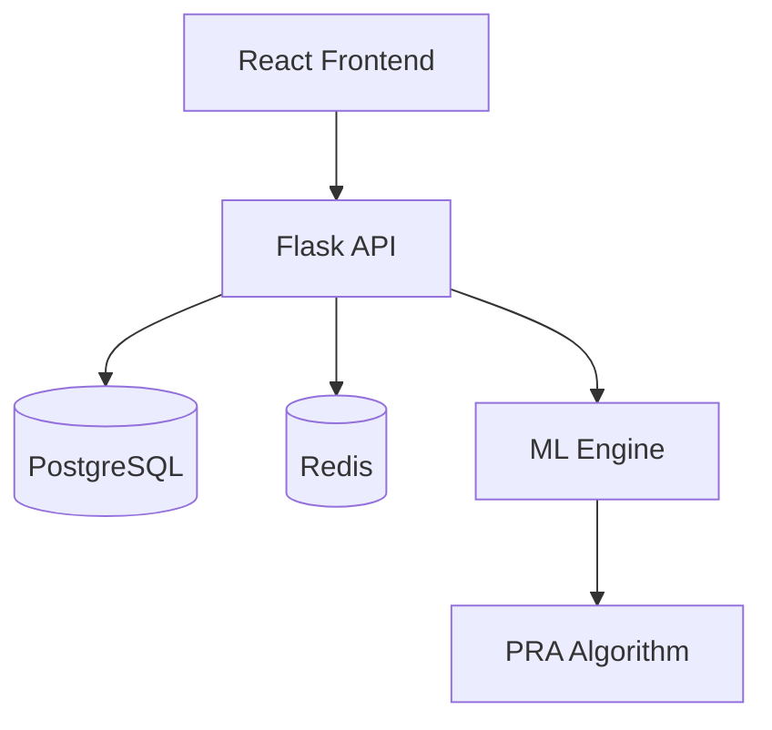
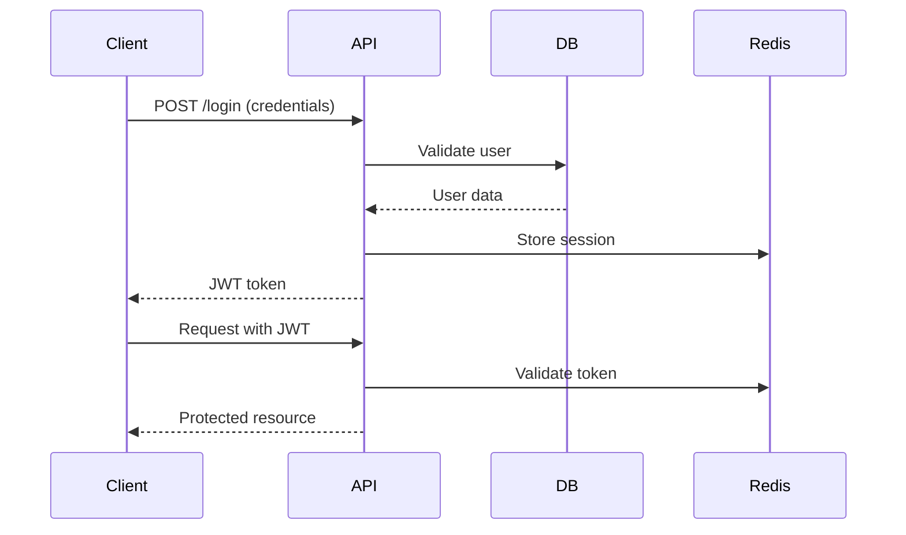
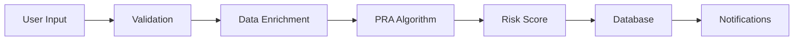

# 🏗️ ToluAI Architecture

## System Overview



## Architecture Principles

- **Microservices-ready**: Modular design for easy scaling
- **API-first**: RESTful API with OpenAPI specification
- **Security-by-design**: RBAC, JWT, encryption at all layers
- **Cloud-native**: Container-based, stateless services
- **Event-driven**: Redis pub/sub for real-time updates

## 🎨 Frontend Architecture

### Tech Stack
- **React 18** - UI framework
- **TypeScript** - Type safety
- **Vite** - Build tool
- **TailwindCSS** - Styling
- **React Query** - Data fetching
- **React Router** - Navigation
- **Recharts** - Data visualization
- **Leaflet** - Maps

### Component Structure

```
frontend/src/
├── components/       # Reusable UI components
│   ├── common/      # Generic components
│   ├── forms/       # Form components
│   └── charts/      # Data visualizations
├── pages/           # Route pages
├── services/        # API services
├── hooks/           # Custom React hooks
├── utils/           # Helper functions
├── types/           # TypeScript types
└── contexts/        # React contexts
```

### State Management
- **Local state**: useState for component state
- **Global state**: Context API for auth/user
- **Server state**: React Query for API data
- **Form state**: React Hook Form

## 🔧 Backend Architecture

### Tech Stack
- **Python 3.11** - Core language
- **Flask 3.0** - Web framework
- **SQLAlchemy** - ORM
- **PostgreSQL 15** - Database
- **Redis** - Caching & sessions
- **Celery** - Async tasks
- **JWT** - Authentication

### Application Structure

```
backend/
├── api/            # API endpoints
│   ├── auth/      # Authentication
│   ├── irpa/      # Risk assessment
│   └── admin/     # Admin endpoints
├── models/         # Database models
├── services/       # Business logic
├── utils/          # Helper functions
├── tasks/          # Async tasks
└── middleware/     # Request middleware
```

### API Design

```python
# RESTful endpoint structure
/api/v2/
├── /auth
│   ├── POST /login
│   ├── POST /logout
│   └── POST /refresh
├── /irpa
│   ├── /insured-entities
│   ├── /assessments
│   └── /analytics
└── /admin
    ├── /users
    └── /settings
```

## 🗄️ Database Architecture

### Schema Design

```sql
-- Core tables
users
companies
insured_entities
risk_assessments
audit_logs

-- Reference tables
states
industry_types
job_titles
education_levels

-- Relationships
user_companies
company_entities
entity_assessments
```

### Key Relationships
- **Users** ↔ **Companies**: Many-to-many
- **Companies** → **Entities**: One-to-many
- **Entities** → **Assessments**: One-to-many
- **Assessments** → **Audit Logs**: One-to-many

## 🔐 Security Architecture

### Authentication Flow



### Security Layers
1. **Network**: SSL/TLS encryption
2. **Application**: JWT authentication
3. **Database**: Encrypted connections
4. **Data**: Encryption at rest
5. **Audit**: Comprehensive logging

## 🚀 Deployment Architecture

### Production Stack

```yaml
Load Balancer (Nginx)
    ├── Frontend (React) - CDN
    ├── API Servers (Flask) - Multiple instances
    ├── Database (PostgreSQL) - Primary/Replica
    ├── Cache (Redis) - Cluster
    └── Queue (Celery) - Workers
```

### Container Architecture

```dockerfile
# Multi-stage build
Frontend Container (nginx)
Backend Container (gunicorn)
Worker Container (celery)
Database Container (postgres)
Cache Container (redis)
```

## 📊 Data Flow

### Risk Assessment Flow



### Caching Strategy
- **Session data**: Redis with 24h TTL
- **API responses**: Redis with 5min TTL
- **Static data**: CDN caching
- **Database queries**: Query result caching

## 🔄 Scalability Design

### Horizontal Scaling
- **Frontend**: CDN distribution
- **API**: Load-balanced instances
- **Database**: Read replicas
- **Cache**: Redis cluster
- **Workers**: Celery scaling

### Performance Optimizations
- Database indexing on key columns
- API response pagination
- Lazy loading for frontend
- Image optimization
- Code splitting

## 🎯 Design Patterns

### Backend Patterns
- **Repository Pattern**: Data access layer
- **Service Layer**: Business logic
- **Factory Pattern**: Object creation
- **Singleton**: Database connections
- **Observer**: Event handling

### Frontend Patterns
- **Component Composition**: Reusable UI
- **Custom Hooks**: Logic sharing
- **Higher-Order Components**: Enhancement
- **Render Props**: Flexible rendering
- **Context Pattern**: Global state

## 📡 Integration Points

### External Services
- **Email**: SendGrid/AWS SES
- **Storage**: AWS S3
- **Monitoring**: DataDog/NewRelic
- **Logging**: ELK Stack
- **CI/CD**: GitHub Actions

### API Integrations
```javascript
// API client example
const apiClient = {
  auth: AuthService,
  irpa: IRPAService,
  analytics: AnalyticsService,
  admin: AdminService
};
```

## 🔍 Monitoring & Observability

### Metrics
- Response times
- Error rates
- Database performance
- Cache hit rates
- User sessions

### Logging
```python
# Structured logging
logger.info("risk_assessment_created", {
    "entity_id": entity.id,
    "risk_score": score,
    "user_id": current_user.id
})
```

### Health Checks
- `/health` - Basic health
- `/ready` - Readiness probe
- `/metrics` - Prometheus metrics

---

[← Back to README](../README.md) | [Developer Guide →](DEVELOPER_GUIDE.md)